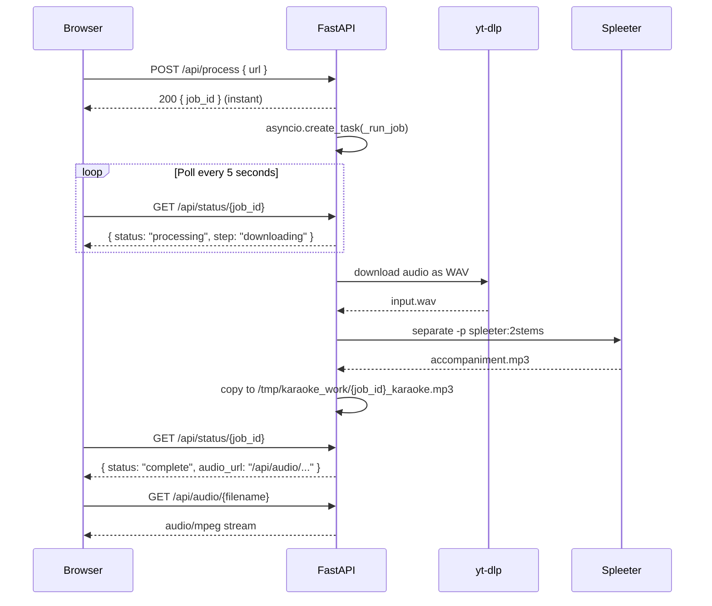

# Karaoke Maker

Paste a YouTube link, get back an instrumental track you can sing over. Vocals are stripped in ~30–60 seconds using [Spleeter](https://github.com/deezer/spleeter) (Deezer's open-source audio separation model).

**Live demo:** [karaoke-maker-production.up.railway.app](https://karaoke-maker-production.up.railway.app)

---

## Table of Contents

- [How It Works](#how-it-works)
- [Architecture](#architecture)
- [Tech Stack & Why We Chose It](#tech-stack--why-we-chose-it)
- [Running Locally](#running-locally)
- [Deploying to Railway](#deploying-to-railway)
- [Configuration](#configuration)
- [Roadblocks We Hit (and How We Solved Them)](#roadblocks-we-hit-and-how-we-solved-them)
- [What We'd Do Differently](#what-wed-do-differently)
- [Limitations](#limitations)

---

## How It Works

1. User pastes a YouTube URL into the UI
2. The server downloads the audio via `yt-dlp`
3. Spleeter separates the audio into two stems: `vocals` and `accompaniment`
4. The `accompaniment` track (everything except vocals) is served back
5. User plays it in-browser or downloads it

---

## Architecture

Processing a song takes 30–90 seconds, which is longer than a typical HTTP request should stay open. To handle this, the app uses a **background job + polling** pattern instead of a single long-lived request.



### Key design decisions

| Decision | Reason |
|---|---|
| Background jobs + polling | Railway's HTTP proxy times out after 5 minutes; processing takes longer |
| In-memory job store (`_jobs` dict) | Simplest possible state store for a single-replica app |
| `asyncio.Semaphore(1)` | Limits to 1 concurrent Spleeter job — CPU can't handle more |
| Files served from `/tmp` | No object storage needed; files cleaned up after 1 hour |
| Rate limit: 3 req / IP / 60s | Prevents a single user from queuing up the server |

---

## Tech Stack & Why We Chose It

### Spleeter (Deezer) — vocal separation
We started with **Demucs** (Meta's model, state of the art) but discovered it takes **10–20 minutes per song** on CPU. Spleeter processes the same song in **30–60 seconds** on CPU. For a karaoke app, speed matters more than research-grade audio quality — Spleeter's output is perfectly good for singing over.

### yt-dlp — YouTube downloading
The de-facto standard for YouTube audio extraction. We use:
- `--js-runtimes node` — uses Node.js to solve YouTube's JS challenges
- `--remote-components ejs:github` — pulls the latest JS solver to handle bot detection
- `--cookies` — browser cookies to bypass IP-based rate limits on server IPs (see roadblocks below)

### FastAPI — web framework
Async-native Python framework. The `asyncio.to_thread()` call wraps the blocking Spleeter subprocess so it doesn't block the event loop while processing.

### Docker — containerization
All dependencies (FFmpeg, Node.js, Python, Spleeter, TensorFlow) are baked into the image. The Spleeter `2stems` model (~80MB) is pre-downloaded at build time so there's no cold-start delay on first request.

### Railway — hosting
We chose Railway over HuggingFace Spaces because:
- HF Spaces free tier is too slow (same 20-min Demucs problem)
- HF Spaces **blocks outbound network during Docker build**, so model pre-download fails
- Railway allows network access during build and gives dedicated CPU with predictable performance

---

## Running Locally

Requires Docker.

```bash
# Build (uses Dockerfile.local which is tuned for ARM64 Macs)
docker build -f Dockerfile.local -t karaoke-local .

# Run
docker run -p 8000:8000 karaoke-local
```

Open [http://localhost:8000](http://localhost:8000).

> First build takes ~5–10 minutes — it downloads TensorFlow and the Spleeter model and bakes them into the image. Subsequent builds are fast due to Docker layer caching.

**Optional:** To enable YouTube downloading without bot detection errors, pass your cookies:

```bash
docker run -p 8000:8000 \
  -e YOUTUBE_COOKIES="$(cat /path/to/cookies.txt)" \
  karaoke-local
```

---

## Deploying to Railway

1. Fork this repo
2. Create a new Railway project → **Deploy from GitHub repo**
3. Railway auto-detects `railway.json` and uses the `Dockerfile`
4. Add a `YOUTUBE_COOKIES` environment variable (see below)
5. That's it — Railway builds and deploys automatically on every push

---

## Configuration

All configuration is via environment variables.

| Variable | Required | Description |
|---|---|---|
| `YOUTUBE_COOKIES` | Recommended | Netscape-format cookie file content. Without this, downloads will fail for many videos on server IPs. |
| `PORT` | Set by Railway | Port to bind uvicorn. Defaults to `8000`. |

### Getting YouTube Cookies

YouTube blocks requests from server IP ranges. The fix is to export your own browser cookies and pass them to yt-dlp.

1. Install the [Get cookies.txt LOCALLY](https://chrome.google.com/webstore/detail/get-cookiestxt-locally/cclelndahbckbenkjhflpdbgdldlbecc) Chrome extension
2. Log in to YouTube in your browser
3. Click the extension → **Export** → copy the file contents
4. In Railway: **Variables** → add `YOUTUBE_COOKIES` → paste the contents

> Cookies expire periodically. If downloads start failing again, re-export and update the variable.

---

## Roadblocks We Hit (and How We Solved Them)

### 1. YouTube blocks server IPs
Server IP ranges (AWS, Railway, HuggingFace) are flagged by YouTube and get `HTTP 403` errors. Regular `yt-dlp` with no configuration fails immediately.

**Fix:** Export your logged-in browser cookies and pass them to yt-dlp via `--cookies`. The request looks like it's coming from a real user session. We also added `--js-runtimes node` and `--remote-components ejs:github` to handle YouTube's JS challenge system.

### 2. Railway's HTTP proxy times out after 5 minutes
Railway (and most cloud platforms) drop HTTP connections that stay open longer than 5 minutes. Spleeter takes 30–90 seconds — fine — but we originally used Demucs which took 10–20 minutes. Even after switching to Spleeter, long HTTP requests are fragile.

**Fix:** Polling architecture. `POST /api/process` returns a `job_id` instantly. The job runs in the background via `asyncio.create_task()`. The frontend polls `GET /api/status/{job_id}` every 5 seconds. No long-lived HTTP connection needed.

### 3. Demucs was way too slow on CPU (we picked the wrong model)
We originally built with Demucs `mdx_extra` because it has best-in-class separation quality. On local (Apple M1), a 4-minute song took ~8 minutes. On Railway's shared CPU, it took **10–20 minutes**. Completely unusable for a web app.

**Fix:** Switched to Spleeter. Same 4-minute song takes ~30 seconds on the same CPU. Quality is slightly lower but more than good enough for karaoke.

> **Lesson:** For a product, always validate processing speed on the actual deployment hardware before committing to a model.

### 4. Spleeter tried to write model files to a root-owned directory
During Docker build, `USER appuser` switches to a non-root user. But Spleeter's default model directory is `./pretrained_models` relative to the working directory (`/app`), which is owned by root.

**Fix:** Set `ENV MODEL_PATH=/home/appuser/pretrained_models` so Spleeter writes to the user's home directory, which they own.

### 5. yt-dlp JS runtime: Deno vs Node.js
yt-dlp needs a JavaScript runtime to solve YouTube's bot-detection challenges. We first tried Deno (downloaded from GitHub at build time), which failed on HuggingFace because they block outbound network during builds. We then tried `--js-runtimes nodejs` which is the wrong flag name.

**Fix:** Install `nodejs` via `apt-get`, use `--js-runtimes node` (not `nodejs`).

### 6. `$PORT` wasn't expanding in Railway
Our Dockerfile originally used the JSON `CMD` form (`["uvicorn", ..., "--port", "$PORT"]`). JSON exec form doesn't go through a shell, so `$PORT` was passed as a literal string.

**Fix:** Use shell form: `CMD ["sh", "-c", "uvicorn main:app ... --port ${PORT:-8000}"]`.

### 7. HuggingFace Spaces blocks network during Docker build
We originally deployed to HuggingFace Spaces (free tier). Pre-downloading the Demucs model during build failed because HF blocks all outbound network connections during the build step.

**Fix:** Moved to Railway, which allows network access during build.

---

## What We'd Do Differently

| What | Why it was a mistake | Better approach |
|---|---|---|
| Starting with Demucs | 10–20 min processing time, unusable on CPU | Start with Spleeter; upgrade to Demucs only if you have GPU |
| Single-request architecture | Timed out on Railway's 5-min proxy limit | Start with polling from day one for any job > 30s |
| Deploying to HuggingFace first | No network during build, free tier too slow | Go straight to Railway or any platform that allows build-time network access |
| In-memory job store | Jobs lost on restart, no persistence | Use Redis or a lightweight DB (SQLite) even for a prototype |
| No job queue | Only 1 concurrent job, others wait up to 30 minutes | Use a proper queue (Celery + Redis, or RQ) if scaling beyond 1 worker |

---

## Limitations

- **YouTube only** — no Spotify, SoundCloud, etc.
- **Max song length: 10 minutes** — longer songs are rejected upfront
- **1 song at a time** — a semaphore limits concurrent jobs to 1 (CPU constraint)
- **Rate limit** — 3 requests per IP per minute
- **Cookies expire** — YouTube cookies need to be refreshed periodically (every few weeks)
- **Quality varies** — Spleeter works best on pop/rock with clear vocal separation; may struggle with heavily layered productions
- **No persistence** — processed files are deleted after 1 hour; job state is lost on restart

---

## License

MIT
