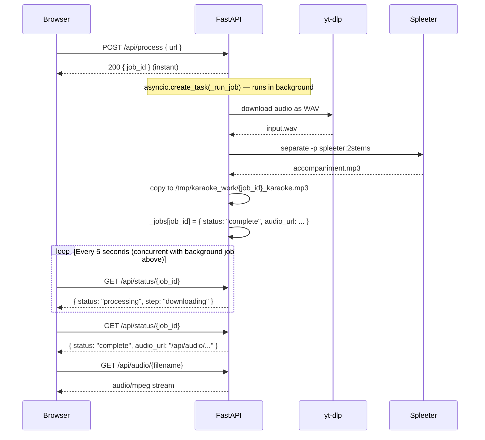

# Karaoke Maker

Paste a YouTube link, get back an instrumental track you can sing over. Vocals are stripped in **30–60 seconds** using [Spleeter](https://github.com/deezer/spleeter) (Deezer's open-source audio separation model).

**Live demo:** [karaoke-maker-production.up.railway.app](https://karaoke-maker-production.up.railway.app)


> **Legal notice:** This tool is intended for personal and educational use. Downloading audio from YouTube may be subject to [YouTube's Terms of Service](https://www.youtube.com/t/terms). You are responsible for ensuring your use complies with applicable laws and terms.

---

## Table of Contents

- [How It Works](#how-it-works)
- [Project Structure](#project-structure)
- [Architecture](#architecture)
- [API Reference](#api-reference)
- [Tech Stack & Why We Chose It](#tech-stack--why-we-chose-it)
- [Running Locally](#running-locally)
- [Deploying to Railway](#deploying-to-railway)
- [Configuration](#configuration)
- [Operational Notes](#operational-notes)
- [Troubleshooting](#troubleshooting)
- [Contributing](#contributing)
- [Roadblocks We Hit (and How We Solved Them)](#roadblocks-we-hit-and-how-we-solved-them)
- [What We'd Do Differently](#what-wed-do-differently)
- [Limitations](#limitations)
- [Acknowledgements](#acknowledgements)

---

## How It Works

1. User pastes a YouTube URL into the UI and clicks **Go**
2. The server downloads the audio via `yt-dlp` (~5–10 seconds)
3. Spleeter splits the audio into two stems: `vocals` and `accompaniment`
4. The `accompaniment` track (everything except vocals) is served back (~30–60 seconds total)
5. User plays it in-browser or downloads the MP3

---

## Project Structure

```
karaoke-app/
├── main.py              # FastAPI backend — all routes and job logic
├── static/
│   └── index.html       # Single-page frontend (vanilla HTML/CSS/JS)
├── Dockerfile           # Production image (x86_64, used by Railway)
├── Dockerfile.local     # Local development image (works on ARM64 Macs)
├── railway.json         # Railway deployment config (healthcheck, restart policy)
├── requirements.txt     # Python dependencies (reference — Docker installs these)
└── LICENSE
```

---

## Architecture

Processing a song takes 30–90 seconds — longer than a typical HTTP request should stay open. To handle this, the app uses a **background job + polling** pattern: the request returns immediately with a `job_id`, and the frontend polls for status until the job completes.



### Key design decisions

| Decision | Reason |
|---|---|
| Background jobs + polling | Railway's HTTP proxy times out after 5 minutes; processing takes 30–90 seconds and could grow |
| In-memory job store (`_jobs` dict) | Simplest possible state store for a single-replica app — no external DB needed |
| `asyncio.Semaphore(1)` | Limits to 1 concurrent Spleeter job — each job uses ~2–3 GB RAM and saturates the CPU |
| Files served from `/tmp` | No object storage needed; files are cleaned up automatically after 1 hour |
| Rate limit: 3 req / IP / 60s | Prevents one user from monopolising the queue |

---

## API Reference

| Method | Path | Description |
|---|---|---|
| `POST` | `/api/process` | Submit a YouTube URL. Returns `{ job_id }` immediately. Body: `{ "url": "https://..." }` |
| `GET` | `/api/status/{job_id}` | Poll for job status. Returns `{ status, step?, audio_url?, error? }` |
| `GET` | `/api/audio/{filename}` | Download or stream the processed MP3. Filename format: `{job_id}_karaoke.mp3` |
| `GET` | `/api/health` | Health check. Returns `{ "status": "ok" }` |

**Job status values:**

| `status` | `step` | Meaning |
|---|---|---|
| `processing` | `queued` | Waiting for the previous job to finish |
| `processing` | `downloading` | yt-dlp is downloading the audio |
| `processing` | `separating` | Spleeter is removing vocals |
| `complete` | — | Done. `audio_url` is populated |
| `error` | — | Failed. `error` contains a human-readable message |

---

## Tech Stack & Why We Chose It

### Spleeter (Deezer) — vocal separation
We started with **Demucs** (Meta's model, state of the art) but discovered it takes **10–20 minutes per song** on CPU. Spleeter processes the same song in **30–60 seconds** on the same hardware. For a karaoke app, speed matters more than research-grade audio quality — Spleeter's output is perfectly good for singing over.

### yt-dlp — YouTube downloading
The de-facto standard for YouTube audio extraction. We use three flags to work around server-side restrictions:
- `--js-runtimes node` — uses system Node.js to solve YouTube's JS challenges
- `--remote-components ejs:github` — fetches the latest YouTube JS solver from GitHub at runtime (yt-dlp's plugin system for keeping up with YouTube's anti-bot updates)
- `--cookies` — passes your browser session cookies so requests don't look like they're coming from a datacenter IP

### FastAPI — web framework
Async-native Python framework. The `asyncio.to_thread()` call wraps the blocking Spleeter subprocess so the event loop stays free while audio is being processed.

### Docker — containerization
All dependencies (FFmpeg, Node.js, Python, Spleeter, TensorFlow) are baked into the image at build time. The Spleeter `2stems` model (~80 MB) is pre-downloaded during the build so the first request has no cold-start delay.

### Railway — hosting
**Cost: ~$5–10/month** on the Hobby plan (usage-based).

We chose Railway over HuggingFace Spaces because:
- HF Spaces **blocks outbound network during Docker build** — model pre-download fails silently
- HF Spaces free tier CPU is too slow for any ML inference
- Railway allows network access during build, gives dedicated CPU, and `$PORT` injection works cleanly

---

## Running Locally

**Prerequisites:** Docker (no other setup required)

```bash
# Clone the repo
git clone https://github.com/your-username/karaoke-maker.git
cd karaoke-maker

# Build — Dockerfile.local works on both ARM64 (Mac) and x86_64
docker build -f Dockerfile.local -t karaoke-local .

# Run
docker run -p 8000:8000 karaoke-local
```

Open [http://localhost:8000](http://localhost:8000).

> **First build takes ~5–10 minutes** — it downloads TensorFlow and the Spleeter model and bakes them into the image. Subsequent builds are fast due to Docker layer caching.

**With YouTube cookies** (recommended — many videos will fail without them):

```bash
docker run -p 8000:8000 \
  -e YOUTUBE_COOKIES="$(cat /path/to/cookies.txt)" \
  karaoke-local
```

---

## Deploying to Railway

**Prerequisites:** Railway account, GitHub account

1. Fork this repo on GitHub
2. Go to [railway.app](https://railway.app) → **New Project** → **Deploy from GitHub repo** → select your fork
3. Railway auto-detects `railway.json` and builds the `Dockerfile`
4. Once deployed, go to **Variables** and add `YOUTUBE_COOKIES` (see [Getting YouTube Cookies](#getting-youtube-cookies) below)
5. Trigger a redeploy — Railway builds and deploys automatically on every push after this

> The first build takes ~5–10 minutes. Watch the build logs to confirm the Spleeter model downloads successfully.

---

## Configuration

| Variable | Required | Description |
|---|---|---|
| `YOUTUBE_COOKIES` | **Required for production** | Netscape-format cookie file content. Without this, most downloads will fail on server IPs. |
| `PORT` | Auto-set by Railway | Port to bind uvicorn. Defaults to `8000` if not set. |

### Getting YouTube Cookies

YouTube blocks datacenter IP ranges. Passing your own logged-in browser cookies makes requests look like they come from a real user.

1. Install the [Get cookies.txt LOCALLY](https://chrome.google.com/webstore/detail/get-cookiestxt-locally/cclelndahbckbenkjhflpdbgdldlbecc) Chrome extension
2. Go to [youtube.com](https://youtube.com) and make sure you're logged in
3. Click the extension icon → **Export** — this downloads a `cookies.txt` file
4. In Railway: **Variables** tab → **New Variable** → name: `YOUTUBE_COOKIES`, value: paste the full file contents

> **Security note:** Your cookies file contains active session tokens. Treat it like a password — never commit it to git, and don't share it.

---

## Operational Notes

### Cookie expiry
YouTube cookies expire. When they do, downloads start returning `403` errors. The fix is to re-export from your browser and update the `YOUTUBE_COOKIES` Railway variable. How often this happens varies (typically every few weeks to a few months depending on account activity).

### Queue behaviour
Only one song is processed at a time. If a second request comes in while one is processing, it waits in the queue (up to 30 minutes) with a `queued` status. In practice with Spleeter, the wait is usually under 2 minutes.

### File cleanup
Processed MP3 files are stored in `/tmp/karaoke_work/` and deleted automatically after 1 hour. Job records in memory are cleared after 2 hours. There is no persistent storage — files are lost on container restart.

---

## Troubleshooting

### Downloads failing with a 403 error
YouTube is blocking the request. Your cookies are either missing or expired.

**Fix:** Re-export cookies from your browser and update the `YOUTUBE_COOKIES` environment variable in Railway. See [Getting YouTube Cookies](#getting-youtube-cookies).

---

### "Processing timed out. Try a shorter song."
The Spleeter process took longer than the allowed timeout. This can happen if:
- The song is very long (close to the 10-minute limit)
- The server is under heavy load

**Fix:** Try again with a shorter song. If it consistently times out on short songs, check the Railway **Metrics** tab — if memory is spiking above 4 GB, the process may be getting killed by the OS before timing out cleanly.

---

### "Failed to download audio"
Usually one of three causes:

| Symptom in the error message | Cause | Fix |
|---|---|---|
| `403` / `Sign in to confirm` | Missing or expired cookies | Re-export cookies and update `YOUTUBE_COOKIES` |
| `Video unavailable` | Region-locked or private video | Try a different video |
| `File size limit exceeded` | Audio file larger than 50 MB | Try a shorter/lower-quality video |

---

### "Output file not found" after separation
Spleeter ran but didn't produce output. This usually means:
- The input audio was corrupted or in an unexpected format
- Spleeter ran out of memory mid-job

**Fix:** Check the Railway deployment logs for a stack trace. If you see an OOM message, your plan may need more RAM. Spleeter requires ~2–3 GB per job.

---

### Build fails at the Spleeter model download step
The pre-download step runs `spleeter separate` on a silent audio file to trigger the model download. If this fails:

- `PermissionError: pretrained_models` — `MODEL_PATH` env var isn't set. Ensure the Dockerfile has `ENV MODEL_PATH=/home/appuser/pretrained_models` **after** the `USER appuser` line.
- Network error — the build runner can't reach the model CDN. Railway should always allow this; try re-triggering the build.

---

### The app deployed but shows a blank page
The `static/index.html` file isn't being served. Check that the `COPY . .` step in the Dockerfile is copying the `static/` directory into `/app/static/`. Run `docker run --rm karaoke-local ls /app/static` to verify.

---

## Contributing

Contributions are welcome. Here's how to get set up:

### 1. Fork and clone

```bash
git clone https://github.com/your-username/karaoke-maker.git
cd karaoke-maker
```

### 2. Build the local image

```bash
docker build -f Dockerfile.local -t karaoke-local .
```

This is the only setup step — all dependencies are inside Docker.

### 3. Run with live reloading

```bash
docker run -p 8000:8000 \
  -v $(pwd)/main.py:/app/main.py \
  -v $(pwd)/static:/app/static \
  -e YOUTUBE_COOKIES="$(cat /path/to/cookies.txt)" \
  karaoke-local
```

Mounting `main.py` and `static/` lets you edit code on your host and see changes without rebuilding. You'll need to restart the container to pick up Python changes (uvicorn doesn't auto-reload in this setup).

### 4. Making changes

- **Backend logic** → `main.py`
- **UI** → `static/index.html` (single file, no build step)
- **Dependencies** → update both `Dockerfile` / `Dockerfile.local` and `requirements.txt`

### 5. Before submitting a PR

- Test your change end-to-end with a real YouTube URL
- If you're changing the Dockerfile, test the full build locally
- Keep PRs focused — one thing at a time

### Good first issues

| Area | Idea |
|---|---|
| Frontend | Show estimated time remaining based on song duration |
| Backend | Add WebSocket support to replace polling |
| Backend | Persist job state to SQLite so jobs survive restarts |
| Backend | Support multiple concurrent jobs with a proper task queue (RQ/Celery) |
| DevOps | Add a GitHub Actions workflow to build and test the Docker image on every PR |
| Quality | Add support for Demucs as a higher-quality option when GPU is available |

---

## Roadblocks We Hit (and How We Solved Them)

### 1. YouTube blocks server IPs
Server IP ranges (AWS, Railway, HuggingFace) are flagged by YouTube and get `HTTP 403` errors. Regular `yt-dlp` with no configuration fails immediately on these IPs.

**Fix:** Export your logged-in browser cookies and pass them to yt-dlp via `--cookies`. The request appears to come from a real user session. We also added `--js-runtimes node` and `--remote-components ejs:github` to handle YouTube's JS challenge system.

### 2. Railway's HTTP proxy times out after 5 minutes
Railway drops HTTP connections that stay open longer than 5 minutes. Even with Spleeter's 30–60 second processing time, a single long-lived HTTP request is fragile across networks.

**Fix:** Polling architecture. `POST /api/process` returns a `job_id` instantly. The job runs in the background via `asyncio.create_task()`. The frontend polls `GET /api/status/{job_id}` every 5 seconds. No long-lived HTTP connection needed.

### 3. Demucs was way too slow on CPU
We originally built with Demucs `mdx_extra` (Meta's model, best-in-class quality). On a local Apple M1, a 4-minute song took ~8 minutes. On Railway's shared CPU it took **10–20 minutes**. Completely unusable.

**Fix:** Switched to Spleeter. Same 4-minute song takes ~30 seconds on the same CPU. Quality is slightly lower but perfectly fine for karaoke.

> **Lesson:** Always benchmark on your actual deployment hardware before committing to an ML model.

### 4. Spleeter tried to write model files to a root-owned directory
During Docker build, `USER appuser` switches to a non-root user. Spleeter's default model path is `./pretrained_models` relative to the working directory (`/app`), which is owned by root.

**Fix:** Set `ENV MODEL_PATH=/home/appuser/pretrained_models` so Spleeter writes to the user's home directory.

### 5. yt-dlp JS runtime: wrong flag name
yt-dlp needs a JavaScript runtime to solve YouTube's bot-detection challenges. We first tried Deno (downloaded from GitHub at build time — fails on HuggingFace because they block outbound network during builds). We then used `--js-runtimes nodejs` which is an invalid flag name.

**Fix:** Install `nodejs` via `apt-get`, use `--js-runtimes node` (not `nodejs`).

### 6. `$PORT` not expanding in Railway
Our Dockerfile originally used the JSON array `CMD` form (`["uvicorn", ..., "--port", "$PORT"]`). JSON exec form bypasses the shell, so `$PORT` was passed as a literal string and uvicorn rejected it.

**Fix:** Shell form: `CMD ["sh", "-c", "uvicorn main:app ... --port ${PORT:-8000}"]`.

### 7. HuggingFace Spaces blocks network during Docker build
We originally deployed to HuggingFace Spaces (free tier). Pre-downloading the model during build failed silently because HF blocks all outbound network during the build step.

**Fix:** Moved to Railway, which allows network access during build.

---

## What We'd Do Differently

| What | Why it was a mistake | Better approach |
|---|---|---|
| Starting with Demucs | 10–20 min processing time — completely unusable on CPU | Start with Spleeter; only upgrade to Demucs if you have GPU |
| Single long-lived HTTP request | Timed out on Railway's 5-min proxy limit | Start with polling from day one for any job > 30s |
| Deploying to HuggingFace first | No network during build, free tier too slow | Go straight to Railway or any platform that allows build-time network access |
| In-memory job store | Jobs lost on restart; doesn't scale past 1 replica | Use Redis or SQLite even for a prototype |
| No job queue | Only 1 concurrent job; others queue up | Use a proper task queue (Celery + Redis, or RQ) before scaling beyond 1 worker |

---

## Limitations

- **YouTube only** — no Spotify, SoundCloud, or other sources
- **Max song length: 10 minutes** — longer videos are rejected before downloading
- **1 song at a time** — CPU and memory can only handle one Spleeter job concurrently
- **Rate limit** — 3 requests per IP per minute
- **Cookies require maintenance** — YouTube cookies expire and need to be refreshed periodically
- **Quality varies** — Spleeter works best on pop/rock with clear vocal separation; may struggle with heavily layered or live recordings
- **No persistence** — processed files are deleted after 1 hour; job state is lost on container restart

---

## Acknowledgements

- [Spleeter](https://github.com/deezer/spleeter) by Deezer Research — the audio separation model that makes this possible
- [yt-dlp](https://github.com/yt-dlp/yt-dlp) — YouTube audio extraction
- [Demucs](https://github.com/facebookresearch/demucs) by Meta Research — what we started with and would recommend if you have GPU
- [FastAPI](https://fastapi.tiangolo.com/) — the web framework
- [FFmpeg](https://ffmpeg.org/) — audio format conversion

---

## License

MIT — see [LICENSE](./LICENSE)
